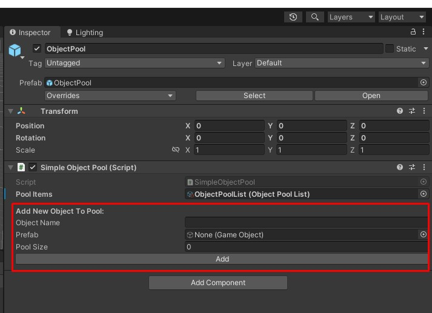

# SimpleObjectPooling

 

A simple implementation of the Object Pooling method in Unity.

## Installation

1. Download the latest release package from the [Releases](https://github.com/Isengard9/SimpleObjectPooling/releases) page.
2. Import the package into your Unity project.
3. Add the `ObjectPool` prefab to your scene.

## Creating Pool Items

1. Open the `SimpleObjectPool` script in your project.
2. In the "Create Pool Item" section, follow these steps:
   - Fill in the pool item name.
   - Select the prefab for the pool item.
   - Set the desired pool item count.

## Usage

### Getting a Pool Object

```csharp
var poolObject = SimpleObjectPool.Instance.GetObjectFromPool("PoolItemName");
if (poolObject == null)
{
    return;
}
```
Use the pooled object

### Returning a Pool Object
```csharp
SimpleObjectPool.Instance.ReturnObjectToPool("PoolItemName", poolObject);
